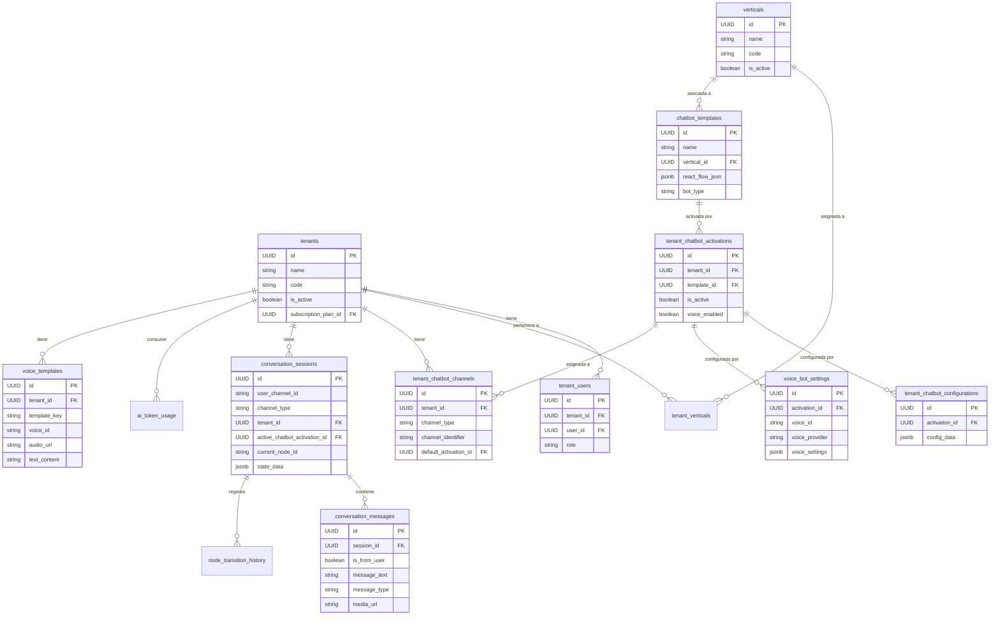

# Plan para la Implementación de Supabase en voiceAgentBot

## 1. Análisis de la Situación Actual

### 1.1 Estructura de Base de Datos Existente

Basado en los archivos de esquema analizados, la base de datos de Supabase ya cuenta con una estructura completa para un sistema multitenant con chatbots:

- **Sistema de Tenants**: Tablas `tenants` y `tenant_users` para gestionar clientes y usuarios.
- **Sistema de Verticales**: Tablas `verticals`, `vertical_categories` y `tenant_verticals` para categorizar negocios.
- **Sistema de Chatbots**: Tablas `chatbot_templates`, `tenant_chatbot_activations` y `tenant_chatbot_configurations`.
- **Sistema de Canales**: Tabla `tenant_chatbot_channels` para diferentes canales de comunicación.
- **Sistema de Conversaciones**: Tablas `conversation_sessions`, `conversation_messages` y `node_transition_history`.
- **Sistema de Analítica**: Tabla `ai_token_usage` para seguimiento de uso de tokens de IA.

### 1.2 Configuración Actual de voiceAgentBot

- Supabase está configurado pero desactivado (`ENABLE_SUPABASE=false`).
- Multitenant está desactivado (`ENABLE_MULTITENANT=false`).
- Ya existen credenciales para conectarse a la instancia de Supabase.

## 2. Verificación de la Estructura Actual en Supabase

Necesitamos verificar la estructura actual en la instancia de Supabase para confirmar:

1. Que las tablas definidas en los archivos de esquema existen.
2. Si hay tablas adicionales no documentadas en los archivos de esquema.
3. Si hay diferencias entre la estructura definida y la implementada.

## 3. Extensiones Necesarias para voiceAgentBot

Basado en el análisis del alcance y las necesidades específicas de voiceAgentBot, necesitamos extender la estructura existente para soportar:

### 3.1 Tablas Adicionales para Procesamiento de Voz

- **voice_bot_settings**: Configuraciones específicas para bots de voz.

  ```sql
  CREATE TABLE voice_bot_settings (
      id UUID PRIMARY KEY DEFAULT uuid_generate_v4(),
      activation_id UUID NOT NULL REFERENCES tenant_chatbot_activations(id) ON DELETE CASCADE,
      voice_id VARCHAR(50) NOT NULL,
      voice_provider VARCHAR(20) NOT NULL, -- 'minimax', 'assemblyai', etc.
      voice_settings JSONB DEFAULT '{}'::JSONB,
      created_at TIMESTAMPTZ DEFAULT NOW(),
      updated_at TIMESTAMPTZ DEFAULT NOW()
  );
  ```

- **voice_templates**: Plantillas de respuestas de voz pre-renderizadas.
  ```sql
  CREATE TABLE voice_templates (
      id UUID PRIMARY KEY DEFAULT uuid_generate_v4(),
      tenant_id UUID NOT NULL REFERENCES tenants(id) ON DELETE CASCADE,
      template_key VARCHAR(100) NOT NULL,
      voice_id VARCHAR(50) NOT NULL,
      audio_url TEXT NOT NULL,
      text_content TEXT NOT NULL,
      created_at TIMESTAMPTZ DEFAULT NOW(),
      updated_at TIMESTAMPTZ DEFAULT NOW(),
      UNIQUE(tenant_id, template_key, voice_id)
  );
  ```

### 3.2 Extensiones a Tablas Existentes

- Añadir campo `bot_type` a la tabla `chatbot_templates`:

  ```sql
  ALTER TABLE chatbot_templates ADD COLUMN IF NOT EXISTS bot_type VARCHAR(20) DEFAULT 'text';
  ```

- Añadir campo `voice_enabled` a la tabla `tenant_chatbot_activations`:
  ```sql
  ALTER TABLE tenant_chatbot_activations ADD COLUMN IF NOT EXISTS voice_enabled BOOLEAN DEFAULT false;
  ```

### 3.3 Buckets de Almacenamiento

Configurar buckets en Supabase Storage para:

- Archivos de audio de entrada (notas de voz recibidas)
- Archivos de audio de salida (respuestas generadas)
- Plantillas de audio pre-renderizadas

## 4. Políticas de Seguridad (RLS)

Extender las políticas de Row Level Security existentes para las nuevas tablas:

```sql
-- Políticas para voice_bot_settings
ALTER TABLE voice_bot_settings ENABLE ROW LEVEL SECURITY;

CREATE POLICY "SUPERADMIN puede gestionar todas las configuraciones de voz"
ON voice_bot_settings
FOR ALL USING (
    auth.jwt() -> 'app_metadata' ->> 'role' = 'superadmin'
);

CREATE POLICY "ADMIN puede gestionar sus propias configuraciones de voz"
ON voice_bot_settings
FOR ALL USING (
    auth.jwt() -> 'app_metadata' ->> 'role' = 'admin' AND
    EXISTS (
        SELECT 1 FROM tenant_chatbot_activations tca
        JOIN tenants t ON tca.tenant_id = t.id
        WHERE tca.id = activation_id AND
        t.id = (auth.jwt() -> 'app_metadata' ->> 'tenant_id')::UUID
    )
);

-- Políticas para voice_templates
ALTER TABLE voice_templates ENABLE ROW LEVEL SECURITY;

CREATE POLICY "SUPERADMIN puede gestionar todas las plantillas de voz"
ON voice_templates
FOR ALL USING (
    auth.jwt() -> 'app_metadata' ->> 'role' = 'superadmin'
);

CREATE POLICY "ADMIN puede gestionar sus propias plantillas de voz"
ON voice_templates
FOR ALL USING (
    auth.jwt() -> 'app_metadata' ->> 'role' = 'admin' AND
    tenant_id = (auth.jwt() -> 'app_metadata' ->> 'tenant_id')::UUID
);
```

## 5. Integración con voiceAgentBot

### 5.1 Activación de Supabase y Multitenant

Modificar el archivo `.env` para activar Supabase y el modo multitenant:

```
ENABLE_SUPABASE=true
ENABLE_MULTITENANT=true
```

### 5.2 Implementación de Cliente de Supabase

Crear o adaptar un cliente de Supabase en voiceAgentBot para interactuar con la base de datos:

```typescript
// src/services/supabaseClient.ts
import { createClient } from "@supabase/supabase-js";
import { Database } from "../types/supabase";

const supabaseUrl = process.env.SUPABASE_URL || "";
const supabaseKey = process.env.SUPABASE_SERVICE_KEY || "";

export const supabase = createClient<Database>(supabaseUrl, supabaseKey);
```

### 5.3 Generación de Tipos TypeScript

Generar tipos TypeScript para la base de datos de Supabase para facilitar el desarrollo:

```bash
npx supabase gen types typescript --project-id gyslfajscteoqhxefudu > src/types/supabase.ts
```

### 5.4 Implementación de Servicios

Crear servicios para interactuar con las tablas de Supabase:

- **TenantService**: Gestión de tenants y usuarios.
- **ChatbotService**: Gestión de plantillas y configuraciones de chatbot.
- **ConversationService**: Gestión de sesiones y mensajes.
- **VoiceService**: Gestión de configuraciones y plantillas de voz.

## 6. Pruebas y Validación

### 6.1 Pruebas de Conexión

Verificar que voiceAgentBot puede conectarse correctamente a Supabase.

### 6.2 Pruebas de Funcionalidad

Probar las operaciones CRUD en las tablas relevantes.

### 6.3 Pruebas de Integración

Verificar que voiceAgentBot puede interactuar correctamente con la base de datos en escenarios reales.

## 7. Documentación

### 7.1 Documentación de la Estructura de Base de Datos

Actualizar la documentación con la estructura completa de la base de datos, incluyendo las extensiones para voiceAgentBot.

### 7.2 Documentación de API

Documentar los endpoints y servicios que interactúan con Supabase.

## 8. Consideraciones Adicionales

### 8.1 Migración de Datos Existentes

Si hay datos existentes en voiceAgentBot que necesitan ser migrados a Supabase, crear scripts de migración.

### 8.2 Gestión de Caché

Implementar estrategias de caché para optimizar el rendimiento, especialmente para archivos de audio.

### 8.3 Monitoreo y Analítica

Configurar sistemas de monitoreo y analítica para seguir el uso de la base de datos y detectar problemas.

## 9. Cronograma Estimado

| Fase                            | Tiempo Estimado | Dependencias |
| ------------------------------- | --------------- | ------------ |
| 1. Verificación de Estructura   | 1 día           | Ninguna      |
| 2. Extensiones de Base de Datos | 2 días          | Fase 1       |
| 3. Configuración de Buckets     | 1 día           | Fase 2       |
| 4. Implementación de Cliente    | 2 días          | Fase 2       |
| 5. Implementación de Servicios  | 3 días          | Fase 4       |
| 6. Pruebas y Validación         | 2 días          | Fase 5       |
| 7. Documentación                | 1 día           | Fase 6       |

**Tiempo total estimado: 12 días laborables**

## 10. Diagrama de la Estructura de Base de Datos


