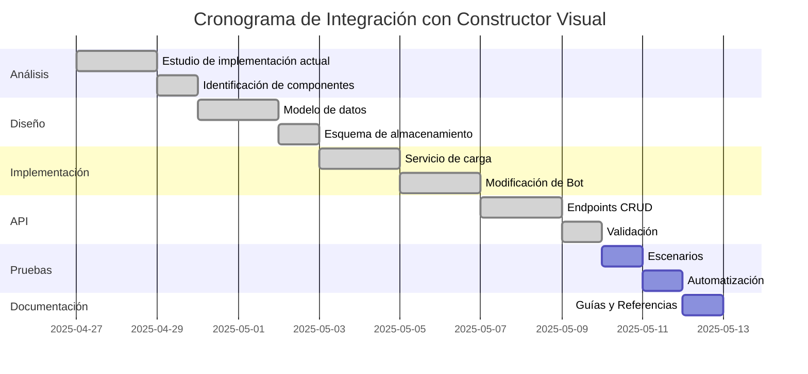

# Plan de Integración Actualizado: Componente VoiceChat con Backend VoiceAgentBot

## Objetivo

Hacer que el widget de demo existente en `http://localhost:3000/concepts/chatbot/demo` (utilizando el componente `VoiceChat` de `agentprop`) sea completamente funcional, integrándolo con el backend `voiceAgentBot` para habilitar la comunicación bidireccional de voz y texto, e implementar la integración con el constructor visual de flujos de IA.

## Estado Actual

### ✅ COMPLETADO:

<!--
1. **Componente VoiceChat mejorado:**

   - Versión actualizada a 1.2.3
   - Corregido error de props duplicados en `animationDelay`
   - Mejorado el sistema de manejo de colores personalizados
   - Optimizada la visualización de audio para diferentes estados
   - Implementado manejo robusto de errores para la reproducción de audio

2. **Página de demostración simplificada:**

   - Versión actualizada a 1.3.0
   - Eliminada la sección "Vista previa (Visual)" y el botón "Ver preview visual"
   - Simplificada la interfaz para enfocarse en la funcionalidad principal

3. **Implementación del componente VoiceChat funcional:**

   - Grabación y reproducción de audio implementada
   - Integración con backend funcionando
   - Manejo de errores robusto

4. **Solución de problemas de hidratación:**

   - Corrección de errores SSR/CSR
   - Uso adecuado de ClientOnly

5. **Corrección de animaciones CSS:**

   - Eliminación de conflictos de estilos
   - Optimización de rendimiento

6. **Adaptación del backend para múltiples formatos de entrada:**
   - Endpoint `/voice/chat` adaptado para aceptar audio y texto
   - Estandarización de respuestas de API
   - Implementación de manejo de errores consistente

7. **Implementación del cargador de flujos dinámicos:**

   - Carga de flujos desde la base de datos
   - Integración con el componente VoiceChat

8. **Desarrollo de API para gestión de flujos:**

   - Endpoints CRUD para flujos
   - Validación de flujos

9. **Integración del componente VoiceChat con flujos dinámicos:**

   - El componente ahora obtiene los datos del flujo desde la API del backend y los utiliza para procesar los mensajes.
   - Se resolvieron los errores relacionados con las dependencias del frontend y la base de datos.
   - El componente VoiceChat ahora funciona correctamente con los flujos dinámicos.
-->

### 🔄 PENDIENTE:

## Fase 3: Integración con el Constructor Visual de Flujos de IA

### 1. Análisis de la arquitectura actual de flujos (2 días)

a. **Estudio de la implementación actual de flujos:**

```typescript
// Análisis de la estructura actual en bot.ts
const welcomeFlow = [
  { role: "system", content: "..." },
  { role: "user", content: "..." },
  // ...
];

const infoFlow = [
  // Definición actual de flujos de información
];
```

b. **Identificación de componentes para la integración:**

- Localizar los puntos donde los flujos se cargan en memoria
- Analizar cómo se asocian los flujos con tenants/agentes
- Determinar cómo mantener el contexto de conversación

### 2. Diseño del esquema de datos para flujos (3 días)

a. **Crear el modelo de datos para los flujos:**

```typescript
interface FlowNode {
  id: string;
  type: "message" | "condition" | "action";
  content: string;
  metadata?: Record<string, any>;
  next?: string | ConditionalNext[];
}

interface ConditionalNext {
  condition: string;
  nextNodeId: string;
}

interface Flow {
  id: string;
  name: string;
  description?: string;
  version: string;
  nodes: Record<string, FlowNode>;
  entryNodeId: string;
  tenantId: string;
  isActive: boolean;
  createdAt: Date;
  updatedAt: Date;
}
```

b. **Diseñar el esquema de almacenamiento:**

- Base de datos para flujos (tablas: flows, flow_nodes, flow_edges)
- Sistema de versionado para mantener múltiples versiones de flujos
- Modelo de permisos y acceso para diferentes tenants

### 3. Implementación del cargador de flujos dinámicos (4 días)

a. **Desarrollar el servicio de carga de flujos:**

```typescript
// En un nuevo archivo: src/services/flowService.ts
export class FlowService {
  async getFlowByTenant(tenantId: string): Promise<Flow | null> {
    // Consulta a base de datos para obtener el flujo activo del tenant
    const flow = await db.flows.findOne({
      where: { tenantId, isActive: true },
      order: [["version", "DESC"]],
    });

    if (!flow) return null;

    // Cargar los nodos y conexiones
    const nodes = await db.flowNodes.findAll({ where: { flowId: flow.id } });

    // Transformar a formato consumible por el bot
    return this.transformToRuntimeFlow(flow, nodes);
  }

  // Método para transformar el flujo de DB a formato runtime
  private transformToRuntimeFlow(flow, nodes): RuntimeFlow {
    // Lógica de transformación
  }
}
```

b. **Modificar el servicio bot para usar flujos dinámicos:**

```typescript
// Modificación en bot.ts
import { FlowService } from "./flowService";

export class Bot {
  private flowService: FlowService;

  constructor() {
    this.flowService = new FlowService();
  }

  async processMessage(message: string, tenantId: string): Promise<string> {
    // Cargar el flujo dinámicamente basado en el tenant
    const flow = await this.flowService.getFlowByTenant(tenantId);

    // Si no hay flujo personalizado, usar el flujo por defecto
    const runtimeFlow = flow || this.getDefaultFlow();

    // Procesar el mensaje usando el flujo dinámico
    return this.processWithFlow(message, runtimeFlow, tenantId);
  }
}
```

### 4. Desarrollo de API para gestión de flujos (3 días)

a. **Crear endpoints para CRUD de flujos:**

```typescript
// En un nuevo archivo: src/api/flows.ts
app.get("/flows/:tenantId", async (req, res) => {
  const { tenantId } = req.params;
  const flows = await flowService.getFlowsByTenant(tenantId);
  res.json({ success: true, flows });
});

app.post("/flows", async (req, res) => {
  const flowData = req.body;
  try {
    const flow = await flowService.createFlow(flowData);
    res.json({ success: true, flow });
  } catch (error) {
    res.status(400).json({ success: false, error: error.message });
  }
});

// Más endpoints: PUT /flows/:id, DELETE /flows/:id, POST /flows/:id/activate
```

b. **Implementar validación de flujos:**

- Verificar integridad estructural (nodos conectados correctamente)
- Validar sintaxis de las condiciones
- Comprobar ciclos infinitos o caminos muertos

### 5. Pruebas de integración de flujos dinámicos (2 días)

a. **Crear escenarios de prueba:**

- Flujos simples lineales
- Flujos con ramificaciones condicionales
- Flujos con integración a sistemas externos
- Escenarios de errores y recuperación

b. **Implementar pruebas automatizadas:**

```typescript
// En tests/flows.test.ts
describe("Flow Integration Tests", () => {
  it("should process a linear flow correctly", async () => {
    // Configurar flujo de prueba
    const testFlow = createTestLinearFlow();
    await flowService.createFlow(testFlow);

    // Simular conversación
    const result = await bot.processMessage("Hola", "test-tenant");

    // Verificar resultado
    expect(result).toContain("Bienvenido a nuestro servicio");
  });

  // Más casos de prueba
});
```

### 6. Documentación y lineamientos de diseño (1 día)

a. **Crear guía para diseño de flujos:**

- Mejores prácticas para diseñar flujos conversacionales
- Limitaciones técnicas y consideraciones de rendimiento
- Ejemplos de flujos comunes (bienvenida, FAQ, recolección de datos)

b. **Documentar API y servicios:**

- Referencias de API para gestión de flujos
- Guía de integración con el componente VoiceChat
- Procedimientos de prueba y depuración

## Diagrama Actualizado del Sistema

```mermaid
graph TD
    A[Usuario] -->|Habla/Escribe| B[Página Demo<br>concepts/chatbot/demo/page.tsx]
    B -->|Captura Audio/Texto| C[VoiceChat<br>Componente v1.2.3]
    B -->|POST /voice/chat| D[Backend voiceAgentBot<br>src/api/voice.ts]

    D -->|Procesa Audio| E[Servicio Transcripción]
    D -->|Procesa Texto| F[Procesamiento Directo]

    E -->|Texto Transcrito| G[Servicio Bot<br>src/services/bot.ts]
    F -->|Texto| G

    G -->|Carga Flujos| H[Servicio de Flujos<br>COMPLETADO]
    H -->|Flujo Activo| G

    G -->|Genera Respuesta| I[BuilderBot]
    I -->|Respuesta Texto| G

    G -->|Texto Respuesta| J[Servicio TTS]
    J -->|Audio URL| D

    D -->|Respuesta<br>{texto, audio_url}| B
    B -->|Actualiza UI| C
    C -->|Muestra/Reproduce| A

    K[Constructor Visual<br>de Flujos] -->|Crea/Edita Flujos| L[API de Flujos<br>COMPLETADO]
    L -->|Almacena| M[(Base de Datos<br>COMPLETADO)]
    M -->|Recupera| H

    classDef completed fill:#d5e8d4,stroke:#82b366,stroke-width:2px;
    classDef pending fill:#f8cecc,stroke:#b85450,stroke-width:2px;
    classDef frontend fill:#d4f1f9,stroke:#05a,stroke-width:2px;
    classDef user fill:#fff2cc,stroke:#d6b656,stroke-width:2px;

    class A user;
    class B,C,D,E,F,G,I,J completed;
    class H,K,L,M pending;
```

## Cronograma Actualizado



## Próximos Pasos Inmediatos

1. Comenzar el análisis detallado del sistema actual de flujos en `bot.ts`
2. Diseñar el esquema de datos para representar flujos conversacionales
3. Planificar la reunión de revisión técnica para validar el enfoque de integración

## Consideraciones Técnicas Adicionales

1. **Rendimiento y Escalabilidad:**

   - Implementar caché de flujos para reducir consultas a la base de datos
   - Considerar la complejidad computacional de evaluación de condiciones en flujos grandes

2. **Seguridad:**

   - Asegurar separación de datos entre tenants
   - Implementar validación estricta para prevenir inyección de código en nodos dinámicos

3. **Compatibilidad:**

   - Mantener compatibilidad retroactiva con flujos hardcodeados existentes
   - Diseñar sistema de migración para convertir flujos actuales al nuevo formato

4. **Limitaciones de Código:**

- Los archivos nuevos no deben tener más de 500 líneas de código.

## Conclusión

Hemos logrado completar con éxito la implementación funcional del componente VoiceChat y su integración con el backend de VoiceAgentBot. El sistema actual permite la comunicación bidireccional mediante voz y texto, con un manejo robusto de errores y una experiencia de usuario optimizada.

El siguiente paso crítico es la integración con el Constructor Visual de Flujos de IA, lo que permitirá al super_admin diseñar y personalizar flujos conversacionales sin necesidad de modificar el código para que esten disponibles las plantillas a los tenants y puedan hacer algunas modificaciones a su gusto (No con un constructor visual, sera algo mas sencillo). Esta capacidad transformará el sistema de un chatbot predefinido a una plataforma conversacional completamente personalizable.
